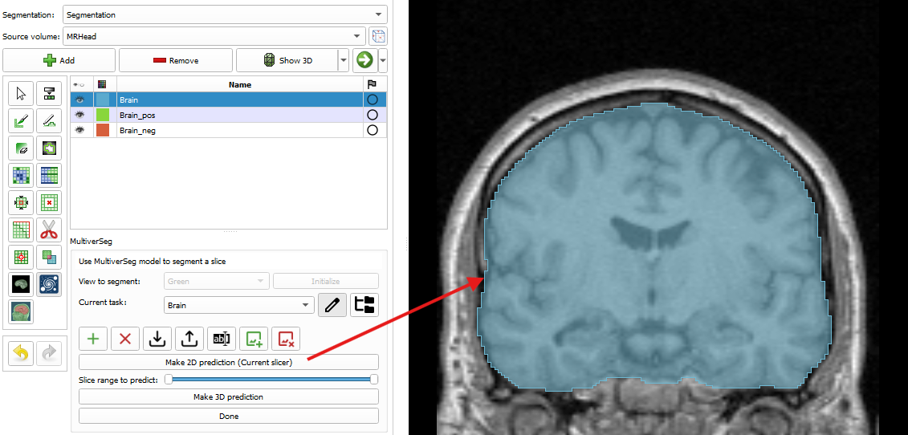
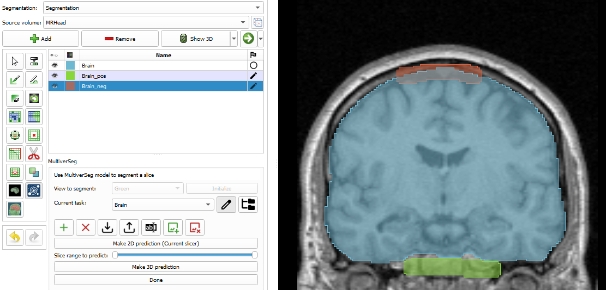
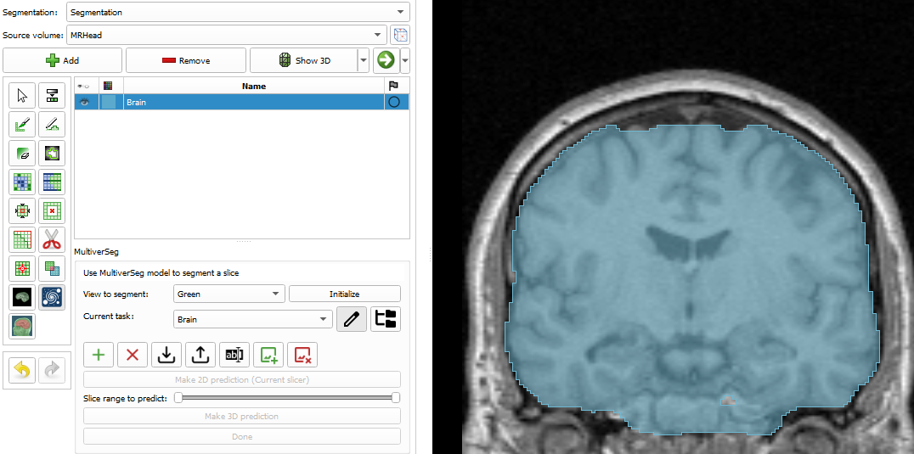

# SlicerMultiverSeg

MultiverSeg is a model that enables users to rapidly segment new biomedical imaging datasets. This extension add a
segmentation effect that uses MultiverSeg.

## MultiverSeg segmentation effect

After installing this extension, a new segmentation effect is available in the Segment Editor that allow the use of the
MultiverSeg model to segment automatically your volume.

### Usage

How to use it:

1. Select the segment on which you want to work.
2. Select the view you want to segment on (Red, Green or Yellow) and click on `Initialize`. (The MultiverSeg model works
   on 2D slices, which is why selecting the orientation of the slices is mandatory)
    - _Note: if you want to change the view on which to segment click on `Done` and start back to step 2._
3. Select the task you are currently working on, for more information see the `task` section bellow.
4. Make a prediction with the button `Make 2D prediction (Current slice)` or `Make 3D prediction` (more information in
   the `Predictions` section).
5. Click on `Done` to validate this prediction and start the process over.

### Predictions

#### 2D predictions

2D predictions predict the segmentation on the current slice selected. You can refine the prediction made by the model
using the `<segment_name>_pos` and `<segment_name>_neg` created when you clicked on the `Initialize` button.
On those segment, you can create "Scribbles" that will guide the model, the scribbles on the positive segment will
indicate to the model that the area marked must be included in the segmentation and the negative segment do the
contrary.
To edit those positive and negative segments, you can use all the other segment effect available in the segment editor (
Paint, Draw, ...).

#### 3D prediction

The 3D prediction works by making 2D predictions on every slice of the volume.
This can be limited by using the range slider to indicate a start and an end slice to avoid segmenting in not desired
areas.

### Task

The tasks are the main force of the MultiverSeg model, it allows the model to learn a new segmentation task with just a
few examples.
But this also mean that **the model cannot work without a task selected or with an empty task**, which is why, when
`--None--` or an empty task is selected, you cannot launch a prediction and a warning message is displayed.

A lot of actions are available to manage your tasks:
\

* A - Toggle the display of the task management buttons (buttons C through I)
* B - Enables you to select a custom directory for the tasks
* C - Create a new task
* D - Delete the current task
* E - Import a task previously exported
* F - Export the current task
* G - Rename the current task
* H - Add an example image to the task
* I - Remove an example image from the task

When adding a new image to a task, the image that will be added will be the current slice from the currently selected
view. You can then choose which segment is the target segmentation to add.

For the model to be really effective at a specific task, we recommend to have between 5 and 10 examples. With less, the
results might be suboptimal, but adding more example can slow down the prediction process.

## Sources

- [MultiverSeg official implementation](https://github.com/halleewong/MultiverSeg)
- [MultiverSeg Project Page](https://multiverseg.csail.mit.edu/)
- [MultiverSeg Paper](https://arxiv.org/abs/2412.15058)

## Screenshots

